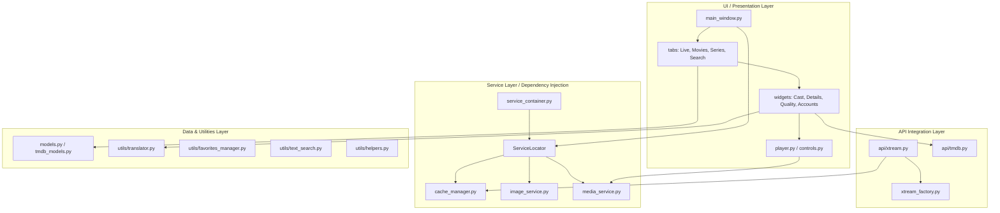

# Sahab IPTV Player


## 🚀 The Ultimate Xtream IPTV Experience

**Sahab IPTV** is a modern, feature-rich, and premium desktop IPTV client tailored for the **Xtream Codes API**. Standardizing on clean architecture, OOP principles, and a robust state-management framework, Sahab IPTV provides an immersive VOD-style interface (similar to Netflix or Plex) enriched with third-party metadata, automatic plot translations, and smart asset caching. 

Whether you are a power user looking for favorites management, background recording, offline export quality options, or multi-profile account support, Sahab IPTV delivers a fast, fluid, and visually stunning UI powered by **PyQt5**.

---

## 🎨 Architecture & System Design

Sahab IPTV is engineered using a decoupled, multi-layered architecture inspired by **Clean Architecture** patterns, ensuring modularity, clear separation of concerns, and robust testability.

### Unified Dependency Flow


### Key Core Architectural Elements:
1. **Presentation Layer (PyQt5 UI)**: Managed by `MainWindow` which dynamically initializes individual functional tabs (`LiveTab`, `MoviesTab`, `SeriesTab`, `SearchTab`) and rich details widgets. It uses a clean 'Fusion' styling sheet with a custom premium dark theme.
2. **Services / DI Layer**: Replaces ad-hoc creation of helpers with a highly disciplined **Dependency Injection (DI) Container** (`ServiceContainer`). Core services like structured caching, media playback engine, background recording, and image loading pipelines are registered as singletons or factories and resolved via a global `ServiceLocator`.
3. **API Integration Layer**: Wraps Xtream Codes API operations (`api/xtream.py`) and TMDB queries (`api/tmdb.py`) inside isolated, type-safe API clients that incorporate automatic retries, timeout parameters, and cache-lookup shortcuts.
4. **Data Models Layer**: Utilizes python `dataclasses` with comprehensive field mapping and default validation fallbacks (`models.py` & `tmdb_models.py`) to prevent missing-key runtime crashes when integrating sparse playlist feeds.

---

## ✨ Cutting-Edge Updated Features

The Sahab IPTV player has been updated with several highly advanced features to elevate the entertainment consumption experience:

### 1. Rich VOD Metadata (TMDB Integration)
To replace sparse, incomplete channel/movie details provided by default IPTV playlists, Sahab IPTV queries **The Movie Database (TMDB) API** dynamically:
* Retrieves high-definition backdrops, posters, original network badges, production companies, and runtime formats.
* Fetches full movie/series credits, listing directors and compiling scrollable cast widgets with billing priority and actor photos.
* Generates localized trailers using the **YouTube Trailer Resolver** utility.

### 2. LibreTranslate Auto-Translation Service
To bridge international language gaps, a smart background translation pipeline (`src/utils/translator.py`) has been added:
* **Automatic Detection**: Employs keyword markers (e.g., `arabic`, `عربي`, `french`, `spanish`) and metadata flags to identify non-English content.
* **On-the-Fly Translation**: Interfaces with **LibreTranslate** to automatically translate English plots into the targeted language of the movie or show.
* **Resilient Caching & Fail-safes**: Caches translations to prevent redundant external network requests and gracefully degrades to original descriptions if services are unreachable or API limits are met. Supports both public portal API keys and local self-hosted docker endpoints.

### 3. Background Quality & Export Selection
During media export, downloads, or playback, a new asynchronous quality selector is available (`QualitySelectionDialog`):
* **HLS Parser Worker**: Uses a background `QThread` worker to fetch and parse HLS master playlists (`.m3u8` files) utilizing the `m3u8` library.
* **Detailed Breakdown**: Extracts discrete streams, parsing specific resolution properties (e.g., 1080p+, 720p, 480p) and network bandwidth requirements (in Mbps).
* **Smart UI Populators**: Displays a detailed data table giving users the exact choice between specific resolutions or selecting an "Auto (Best Available)" fallback.

### 4. Smart Asset Caching & Preloader Engine
* **Structured Local Storage**: Automatically caches database indices, stream URLs, EPG timetables, and details mapping under `~/.sahabiptv/cache` to secure sub-millisecond response times.
* **Image Cache Loader**: Asynchronously fetches poster images and profile photos, utilizing low-resolution placeholder assets that smoothly fade into high-res images as downloading threads complete.

---

## 📂 Repository File Structure

```
sahabIPTV/
├── main.py                    # Entry point; initializes QApplication & dark mode layout
├── requirements.txt           # Main python third-party library dependencies
├── PRD.md                     # Comprehensive Product Requirements Document
├── TMDB_MODELS.md             # Detailed breakdown of TMDB models usage and rules
├── TRANSLATION_FEATURE.md     # In-depth guide to LibreTranslate setup and API key portal
├── test_quality_selection.py  # Standalone test runner for quality detection
├── assets/                    # Shared image icons, logo, and system icons
│   └── sahab_icon.png
└── src/
    ├── config.py              # User preferences, window layout sizes, cache paths
    ├── constants.py           # Centralized system constants, durations, and clean error messages
    ├── models.py              # Xtream dataclasses (SeriesItem, MovieItem) and parser dictionaries
    ├── tmdb_models.py         # TMDB metadata structures (MovieDetails, SeriesDetails, Credits, Cast)
    ├── api/
    │   ├── tmdb.py            # Async TMDB API Wrapper with localized language query parameters
    │   ├── xtream.py          # Fully compliant Xtream API client with endpoint validators
    │   └── xtream_factory.py  # Factory creator for generating session-active Xtream clients
    ├── services/
    │   ├── service_container.py # Central Dependency Injection registry and ServiceLocator
    │   ├── cache_manager.py   # High-performance local cache and history serialization
    │   ├── image_service.py   # Async image loaders and preload controller threads
    │   └── media_service.py   # Native MPV/VLC media player handlers and live TV recorder
    ├── ui/
    │   ├── main_window.py     # Outer shell window; binds sidebar tabs and navigation flows
    │   ├── player.py          # Embedded VLC/MPV video controller widget with keyboard hooks
    │   ├── tabs/
    │   │   ├── live_tab.py    # Grouped TV list, timeline EPGS, and active channel player
    │   │   ├── movies_tab.py  # Netflix-style grid carousel, banners, and filters
    │   │   ├── series_tab.py  # Seasons selector, episode listing, and watched progress tracking
    │   │   ├── search_tab.py  # Universal real-time database fuzzy search tab
    │   │   └── favorites_manager.py # Direct management of user-pinned content
    │   └── widgets/
    │       ├── cast_widget.py # Rounded actor avatars carousel with role details
    │       ├── controls.py    # TV-optimized on-screen display (OSD) control actions
    │       ├── dialogs.py     # Custom styling overlays (warnings, search, settings panels)
    │       ├── home_screen.py # Fluid home view showcasing highlights and resume options
    │       ├── movie_details_widget.py # Translucent glass details panel for VOD assets
    │       ├── series_details_widget.py # Seasons and TV details panel with episode grid
    │       ├── account_management.py # Multi-server/profile selector screen
    │       ├── account_edit_dialog.py # Editor panel for server details and user credentials
    │       └── quality_selection_dialog.py # Background HLS parser dialog for export options
    └── utils/
        ├── favorites_manager.py # Persistent favorites registry tracking
        ├── helpers.py         # Time format parsers, theme appliers, and PyQt modifiers
        ├── image_cache.py     # Image cache wrapper functions
        ├── recorder.py        # Stream dump records pipeline
        ├── text_search.py     # High-performance search engines with matching ratios
        ├── translator.py      # LibreTranslate integration manager and translation caches
        └── youtube_resolver.py # YouTube search resolver mapping for trailers
```

---

## ⚡ Technical Stack & Requirements

* **Language**: Python 3.8+
* **GUI Engine**: PyQt5 (Standardizing on `Fusion` styling)
* **Media Playback**: Native embedded integration with **libmpv** (`python-mpv`) and **VLC** (`python-vlc`).
* **HLS / Stream Parser**: `m3u8` & `requests`
* **Utility Engines**: `opencv-python` (video metrics/thumbnails), `yt-dlp` (streaming resolvers).

---

## ⚙️ Getting Started & Setup

Follow these steps to configure your Python Virtual Environment (`venv`) and run Sahab IPTV on your local system:

### 1. Initialize Python Virtual Environment
Initialize a fresh environment inside the repository folder, and activate it:

```bash
# Navigate to the repository
cd sahabIPTV

# If venv is not yet created, generate it:
python3 -m venv venv

# Activate on macOS / Linux:
source venv/bin/activate

# Or activate on Windows:
venv\Scripts\activate
```

### 2. Install Core Dependencies
Install the required packages utilizing the Python environment's pip engine:

```bash
pip install --upgrade pip
pip install -r requirements.txt
```

### 3. Setup Environment Variables (`.env`)
Create a `.env` file in the root directory to activate the TMDB metadata enrichment and LibreTranslate translation engine. Paste the following configuration, providing your private API details:

```env
# TMDB API Configuration (Required for movies/series details)
# Get yours from: https://www.themoviedb.org/settings/api
TMDB_APIACCESS_TOKEN=your_tmdb_api_key_here
TMDB_READACCESS_TOKEN=your_tmdb_read_access_token_here

# LibreTranslate Configuration (Optional for plot translations)
# Get a free key at: https://portal.libretranslate.com
LIBRETRANSLATE_API_KEY=your_libretranslate_api_key_here
```

### 4. Run the Application
Execute the main entry script:

```bash
python main.py
```

---

## 🧪 Running Developer Tests

The codebase includes targeted developer verification scripts. Make sure you are inside the activated `venv` before running:

### Verify Quality Selection Dialog
This simulates an HLS playlist parsing sequence and displays the quality dialog in isolation:
```bash
python test_quality_selection.py
```

### Verify Translation Engine
Tests the connection to LibreTranslate, language detection, translation mappings, and local memory caches:
```bash
python test_translation.py
```

---

## 🤝 Contributing & Standards

We maintain clean code conventions. When modifying or extending Sahab IPTV:
* **Single Responsibility**: Keep UI classes decoupled from core API fetching; handle state changes inside service singletons.
* **No Hardcoded Keys**: Always add new configuration variables to `src/config.py` or `.env`.
* **RTL Compatibility**: Ensure layout alignments adapt smoothly, keeping Arabic text Right-to-Left (RTL) friendly.

---

*Sahab IPTV — Your portal to a world of beautiful, high-performance streaming.*
